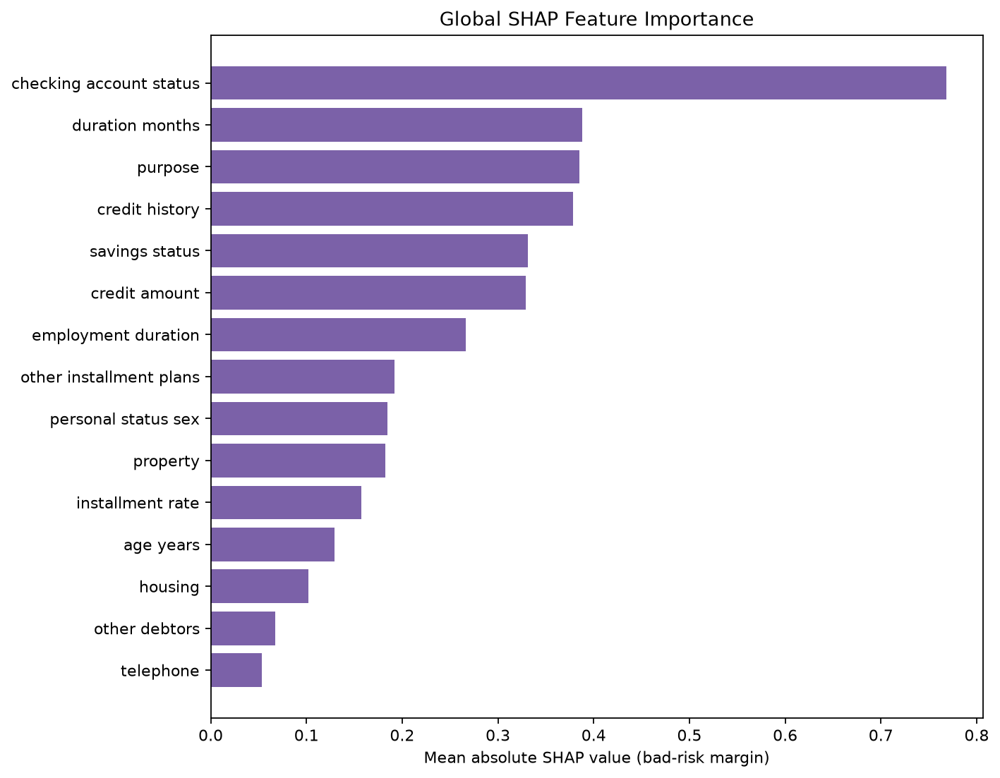

# Day 4 Explainability and Decision Support

This report is generated from the saved Day 3 inference pipeline. No model is fitted or retrained during Day 4 prediction or explanation.

## Model and target

- Final model: **gradient_boosting**
- Decision threshold: **0.13**
- Original target: `1 = good credit risk`, `2 = bad credit risk`.
- Training target: `0 = good credit risk`, `1 = bad credit risk`.
- `bad_risk_probability` is the saved classifier's probability for fitted class label `1`, verified from `classes_`.

## Risk score and display bands

`risk_score = bad_risk_probability × 100`

- LOW: `0 ≤ score < 30` — Lower Predicted Risk
- MODERATE: `30 ≤ score < 60` — Manual Review Suggested
- HIGH: `60 ≤ score ≤ 100` — Higher Predicted Risk

The model's **0.13 classification threshold** and the **30/60 display-band boundaries** serve different purposes. The former converts model probability into its cost-sensitive predicted class. The latter organizes a 0–100 display for educational decision support. The bands are project-defined, not banking or regulatory standards.

## SHAP interpretation

SHAP is calculated after the saved `ColumnTransformer` transforms the original applicant fields. The final Gradient Boosting explainer produces additive contributions in raw bad-risk margin (log-odds) units. For every explanation, additivity is checked against `decision_function`, and the logistic transform is checked against the fitted class-1 probability. Therefore, positive values are labelled risk-increasing only after confirming that they increase bad-risk probability; negative values are protective for that prediction.

Categorical one-hot features are converted to readable labels such as `checking account status = < 0 DM (A11)` or `checking account status is not no checking account (A14)`.

## Global SHAP importance

Mean absolute SHAP values are aggregated from transformed columns back to the 20 original applicant features. They measure influence magnitude, not causal effect.

| Rank | Feature | Mean absolute SHAP |
|---:|---|---:|
| 1 | checking_account_status | 0.768225 |
| 2 | duration_months | 0.388251 |
| 3 | purpose | 0.384903 |
| 4 | credit_history | 0.378391 |
| 5 | savings_status | 0.331022 |
| 6 | credit_amount | 0.328693 |
| 7 | employment_duration | 0.266064 |
| 8 | other_installment_plans | 0.192058 |
| 9 | personal_status_sex | 0.184275 |
| 10 | property | 0.182470 |
| 11 | installment_rate | 0.157073 |
| 12 | age_years | 0.129418 |
| 13 | housing | 0.102095 |
| 14 | other_debtors | 0.067211 |
| 15 | telephone | 0.053654 |

## Real applicant examples

### Example 1: LOW

- Source row: 327
- Bad-risk probability: **0.049940**
- Classification: **good** at threshold `0.13`
- Risk score: **4.99**
- Suggested action: **Lower Predicted Risk**

Risk-increasing factors:
  - housing = rent (A151) (SHAP +0.1816)
  - employment duration is not 4 to < 7 years (A74) (SHAP +0.0709)
  - purpose = furniture/equipment (A42) (SHAP +0.0691)
  - purpose is not used car (A41) (SHAP +0.0691)
  - property is not real estate (A121) (SHAP +0.0438)

Protective factors:
  - checking account status = no checking account (A14) (SHAP -0.5899)
  - credit history = critical account or other credits outside this bank (A34) (SHAP -0.4356)
  - savings status is not < 100 DM (A61) (SHAP -0.1775)
  - savings status = unknown or no savings account (A65) (SHAP -0.1413)
  - personal status sex = male: single (A93) (SHAP -0.1086)

### Example 2: MODERATE

- Source row: 647
- Bad-risk probability: **0.449638**
- Classification: **bad** at threshold `0.13`
- Risk score: **44.96**
- Suggested action: **Manual Review Suggested**

Risk-increasing factors:
  - credit history = no credits taken or all credits paid back duly (A30) (SHAP +0.5198)
  - checking account status is not no checking account (A14) (SHAP +0.5145)
  - duration months = 30 (SHAP +0.4474)
  - personal status sex = male: divorced/separated (A91) (SHAP +0.2688)
  - savings status = < 100 DM (A61) (SHAP +0.2314)

Protective factors:
  - other debtors = guarantor (A103) (SHAP -0.7492)
  - installment rate = 2 (SHAP -0.2627)
  - purpose is not new car (A40) (SHAP -0.0997)
  - age years = 32 (SHAP -0.0766)
  - employment duration is not < 1 year (A72) (SHAP -0.0698)

### Example 3: HIGH

- Source row: 236
- Bad-risk probability: **0.750105**
- Classification: **bad** at threshold `0.13`
- Risk score: **75.01**
- Suggested action: **Higher Predicted Risk**

Risk-increasing factors:
  - checking account status is not no checking account (A14) (SHAP +0.5123)
  - duration months = 24 (SHAP +0.4769)
  - employment duration = unemployed (A71) (SHAP +0.3399)
  - checking account status = < 0 DM (A11) (SHAP +0.3124)
  - savings status = < 100 DM (A61) (SHAP +0.2578)

Protective factors:
  - job = management/self-employed/highly qualified employee/officer (A174) (SHAP -0.1040)
  - purpose = radio/television (A43) (SHAP -0.0972)
  - purpose is not new car (A40) (SHAP -0.0755)
  - personal status sex = male: single (A93) (SHAP -0.0732)
  - credit amount = 1823 (SHAP -0.0615)

## Limitations

- The score is model probability scaled to 0–100; it is not an official credit score.
- Risk bands and suggested actions are educational project conventions, not approval or denial rules.
- SHAP explains this fitted model's behavior, not causality, applicant intent, or fairness.
- One-hot SHAP contributions can describe both the presence and absence of categories; correlated features can share or redistribute importance.
- The German Credit dataset is small, historical, and includes sensitive or proxy attributes. Human review and fairness analysis are required before any real-world use.
- FinSight must not be used as an automated lending decision system.
